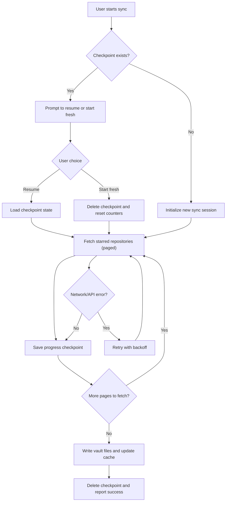

# GitHub Stargazer

An Obsidian plugin that syncs and manages your GitHub starred repositories directly in your vault. Keep track of interesting projects, add personal notes, tag them for easy discovery, and build your personal knowledge base of useful code repositories.

## Features

- **Sync Starred Repositories** - Automatically fetch all repositories you've starred on GitHub using the GraphQL API
- **Sync Progress Tracking & Resume** - Never lose progress! Sync is automatically saved with checkpoint support:
  - Resume interrupted syncs from where you left off
  - Real-time progress display shows repositories fetched
  - Automatic retry with exponential backoff for network errors
  - Checkpoint persists across Obsidian restarts
  - Force full sync option to start fresh
- **Repository Information** - Store comprehensive metadata including:
  - Repository name, description, and URL
  - Star count and primary programming language
  - Owner information and creation dates
  - README.md content in markdown format
  - When you starred the repository
- **Custom Tags** - Organize repositories with custom tags and color coding
- **Personal Notes** - Add markdown notes to any repository for personal reference
- **Linked Resources** - Attach links to external documentation, tutorials, or related resources
- **Auto-Sync** - Optional automatic synchronization on plugin load and at configurable intervals
- **Sync Modes** - Choose between incremental updates or full re-sync
- **Keep Unstarred** - Preserve local copies of repositories even after un-starring them on GitHub
- **Smart Caching** - Efficient data storage and retrieval with configurable cache limits

## Installation

### From Release (Recommended)

1. Download the latest release from the [Releases](https://github.com/yourusername/obsidian-github-stargazer/releases) page
2. Extract the files to your vault's `.obsidian/plugins/github-stargazer/` directory
3. Enable the plugin in Obsidian's Community Plugins settings

### From Source

```bash
# Clone the repository
git clone https://github.com/yourusername/obsidian-github-stargazer.git
cd obsidian-github-stargazer

# Install dependencies
pnpm install

# Build the plugin
pnpm run build

# Copy files to your vault
cp main.js manifest.json .obsidian/plugins/github-stargazer/
cp styles.css .obsidian/plugins/github-stargazer/  # if present
```

## Setup

1. **Generate a GitHub Personal Access Token**
   - Go to GitHub Settings → Developer settings → Personal access tokens → Tokens (classic)
   - Create a new token with `read:org` and `public_repo` scopes (or `repo` for private repositories)
   - Copy the token

2. **Configure the Plugin**
   - Open Obsidian Settings → Community Plugins → GitHub Stargazer
   - Paste your GitHub token
   - Configure auto-sync preferences (optional)

3. **Start Syncing**
   - Click the ribbon icon (star icon) or use the command palette
   - Choose "Sync Starred Repositories" for incremental sync
   - Choose "Sync Starred Repositories (Force Full Sync)" to fetch all data

## Usage

### Commands

- **Sync Starred Repositories** - Start or resume syncing repositories
  - If a previous sync was interrupted, you'll be prompted to resume or start fresh
  - Shows real-time progress with fetched/converted repository counts
- **Sync Starred Repositories (Force Full Sync)** - Ignore any checkpoint and start a fresh sync from scratch
- **Open Repository View** - View and browse your synced repositories (coming soon)
- **Batch Un-star** - Manage and batch un-star repositories (coming soon)

### Sync Progress & Resume

The plugin automatically saves your sync progress, so you never lose work:



**What Gets Saved**:
- Sync position (which page you're on)
- Repositories fetched so far
- Total repository count
- Timestamp and session ID

**When Sync is Interrupted**:
1. Next sync attempt shows a confirmation modal
2. Choose to resume from checkpoint or start fresh
3. Resume skips already-fetched repositories (saves time and API quota)
4. Progress is shown in real-time with fetched/converted counts

**Checkpoint Management**:
- Checkpoints are automatically deleted after successful sync
- View checkpoint info in Settings → GitHub Stargazer
- Manually reset checkpoint from settings if needed
- Checkpoint file location: `.obsidian/plugins/obsidian-github-stargazer/.sync-checkpoint.json`

**Error Recovery**:
- Network errors trigger automatic retry (3 attempts with exponential backoff)
- Checkpoint is preserved even if sync fails
- Corrupted checkpoint files are automatically preserved for debugging

### Managing Repositories

Once synced, you can:
- **Browse** all your starred repositories in an organized view
- **Add Notes** - Write personal notes about why you starred a repo or how you use it
- **Apply Tags** - Create custom tags to categorize repositories by technology, use case, or any system you prefer
- **Link Resources** - Attach links to blog posts, tutorials, or documentation related to the repository
- **Search** - Quickly find repositories by name, tags, or notes

## Development

### Prerequisites

- Node.js >= 18.0.0
- pnpm >= 9.0.0
- TypeScript 5.3+

### Building

```bash
# Install dependencies
pnpm install

# Development mode with hot reload
pnpm run dev

# Production build
pnpm run build

# Run tests
pnpm test

# Run tests with UI
pnpm run test:ui

# Run tests with coverage
pnpm run test:coverage

# Lint code
pnpm run lint
```

### Project Structure

```
src/
├── commands/          # Command implementations (sync, force sync, etc.)
├── storage/           # Data persistence (repositories, settings, sync state)
│   ├── repository-store.ts       # Repository CRUD operations
│   ├── settings-store.ts          # Plugin settings management
│   └── sync-state-store.ts        # Sync progress state tracking
├── sync/              # Sync orchestration and checkpoint management
│   ├── github-client.ts           # GitHub GraphQL API client with retry logic
│   ├── sync-service.ts            # Main sync orchestration
│   ├── checkpoint-manager.ts      # Checkpoint file I/O
│   ├── checkpoint-validator.ts    # Checkpoint validation
│   ├── sync-resume.ts             # Resume workflow
│   ├── sync-page-fetcher.ts       # Pagination logic
│   ├── sync-checkpoint-handler.ts # Checkpoint operations
│   └── sync-change-detector.ts    # Incremental sync change detection
├── ui/                # User interface components
│   ├── settings-tab.ts            # Plugin settings UI
│   ├── sync-progress.ts           # Progress display modal
│   └── checkpoint-modal.ts        # Resume confirmation modal
├── utils/             # Helper functions and constants
│   ├── logger.ts                 # Logging utilities (sanitizes errors)
│   ├── disk-check.ts             # Disk space verification
│   ├── date-utils.ts             # Date formatting utilities
│   └── constants.ts              # App constants
├── types.ts           # TypeScript type definitions
└── main.ts            # Plugin entry point

tests/                  # Vitest test files
├── unit/              # Unit tests for individual components
├── integration/       # Integration tests for workflows
└── mocks/             # Mock implementations for testing

docs/                   # Documentation
├── constitution-compliance.md     # Code quality compliance report
├── performance-verification.md    # Performance analysis
├── quickstart-test-coverage.md    # Test coverage report
├── sensitive-data-verification.md # Security audit
└── checkpoint-location-verification.md # File location verification
```

## Contributing

Contributions are welcome! Please feel free to submit a Pull Request.

1. Fork the repository
2. Create your feature branch (`git checkout -b feature/AmazingFeature`)
3. Commit your changes (`git commit -m 'Add some AmazingFeature'`)
4. Push to the branch (`git push origin feature/AmazingFeature`)
5. Open a Pull Request

## Code Quality

This project uses:
- **TypeScript** with strict mode for type safety
- **ESLint** with Obsidian-specific rules for code quality
- **Vitest** for unit testing
- **esbuild** for fast, optimized builds

## License

MIT License - see LICENSE file for details

## Acknowledgments

- Built with [Obsidian API](https://docs.obsidian.md)
- Uses GitHub GraphQL API for repository data
- Inspired by the need to better organize and learn from starred repositories

## Support

If you encounter any issues or have feature requests, please:
- Check existing [GitHub Issues](https://github.com/yourusername/obsidian-github-stargazer/issues)
- Create a new issue with details about the problem
- Include error logs and steps to reproduce

## Roadmap

- [ ] Repository browser view with filtering and search
- [ ] Tag management UI with color picker
- [ ] Batch operations (un-star, export, etc.)
- [ ] Import/export functionality
- [ ] Statistics and insights dashboard
- [ ] Integration with other Obsidian plugins
