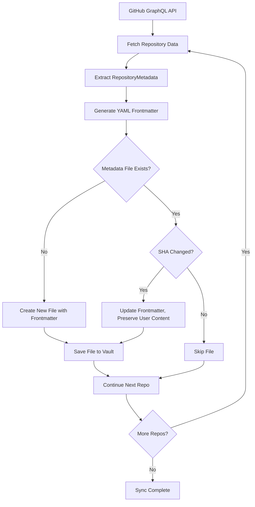
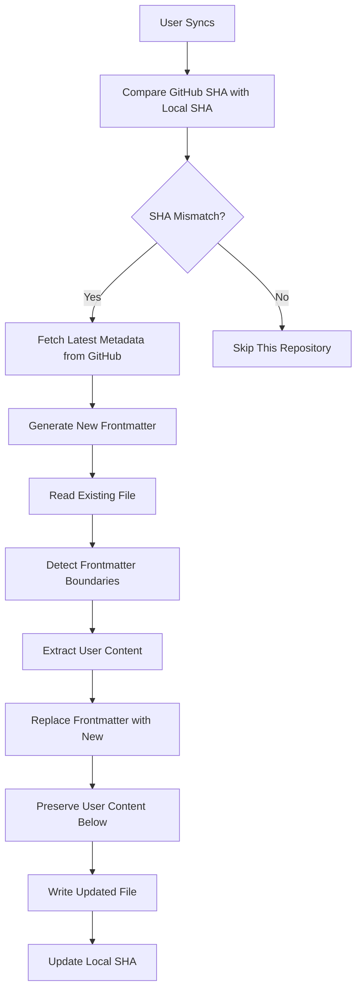
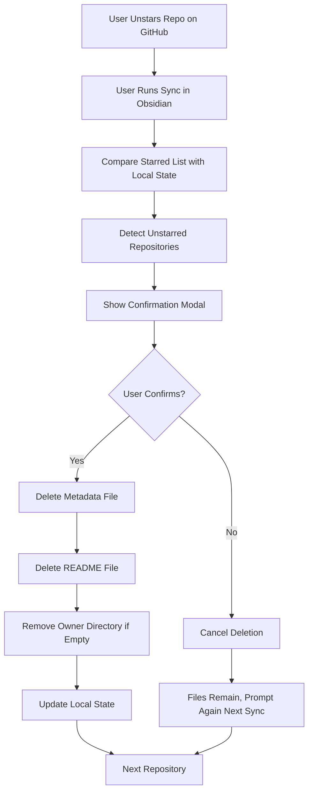

# Data Model: Repository Metadata as Frontmatter

**Feature**: 006-repo-metadata-frontmatter
**Date**: 2025-01-05
**Status**: Phase 1 Design

## Overview

This document defines the data structures and entities for the repository metadata frontmatter feature. All types will be implemented in TypeScript and added to `src/types.ts`.

---

## Core Entities

### 1. RepositoryMetadata (New Interface)

Frontmatter metadata stored in each repository's metadata file.

```typescript
/**
 * Repository metadata extracted from GitHub API for YAML frontmatter
 */
export interface RepositoryMetadata {
  /** Repository name (e.g., "react") */
  name: string;

  /** Full name with owner (e.g., "facebook/react") */
  fullName: string;

  /** Repository description or null if not provided */
  description: string | null;

  /** Total number of stars */
  starCount: number;

  /** Primary programming language or null if not detected */
  language: string | null;

  /** Primary language object with color (from GraphQL) */
  primaryLanguage: {
    name: string;
    color: string | null;
  } | null;

  /** Array of topic names */
  topics: string[];

  /** GitHub repository URL */
  url: string;

  /** Repository owner login (username) */
  ownerLogin: string;

  /** Repository creation timestamp (ISO8601) */
  createdAt: string;

  /** Last update timestamp (ISO8601) */
  updatedAt: string;

  /** Custom homepage URL or null if not set */
  homepageUrl: string | null;

  /** License SPDX identifier (e.g., "MIT", "Apache-2.0") or null */
  license: string | null;

  /** Total number of forks */
  forkCount: number;

  /** Total number of open issues */
  openIssuesCount: number;

  /** Total number of watchers */
  watchersCount: number;
}
```

**Validation Rules**:
- `name`: Non-empty string, max 100 chars
- `fullName`: Must contain `/`, format `owner/repo`
- `starCount`, `forkCount`, `openIssuesCount`, `watchersCount`: Non-negative integers
- `topics`: Array of non-empty strings, max 30 topics
- `url`, `createdAt`, `updatedAt`, `ownerLogin`: Required, non-null
- `description`, `language`, `homepageUrl`, `license`: Nullable

**State Transitions**: None (immutable snapshot from GitHub API)

---

### 2. FileOperationResult (New Interface)

Result of a file system operation (create, update, delete).

```typescript
/**
 * Result of a file system operation on vault files
 */
export interface FileOperationResult {
  /** Whether the operation completed successfully */
  success: boolean;

  /** Relative path of the file in the vault */
  filePath: string;

  /** Action that was performed or attempted */
  action: 'created' | 'updated' | 'deleted' | 'skipped';

  /** Error if operation failed, null otherwise */
  error: Error | null;

  /** Human-readable message for logging/UI (optional) */
  message?: string;
}
```

**Validation Rules**:
- `filePath`: Non-empty string, valid relative path
- `action`: One of the four allowed values
- `error`: Present if `success === false`, null otherwise

**Usage**:
- Returned by all file manager operations
- Used for progress tracking and error reporting
- Logged to sync checkpoint for debugging

---

### 3. RepositoryMetadataFile (New Interface)

Represents a metadata file in the vault with frontmatter and user content.

```typescript
/**
 * A metadata markdown file stored in the vault
 */
export interface RepositoryMetadataFile {
  /** Relative path from vault root (e.g., "facebook/react/facebook-react-metadata.md") */
  filePath: string;

  /** Repository metadata from GitHub API */
  metadata: RepositoryMetadata;

  /** YAML frontmatter block as string (including --- markers) */
  frontmatter: string;

  /** User-written content below frontmatter (preserved during updates) */
  userContent: string;

  /** SHA-256 hash of metadata (for change detection) */
  metadataSha: string;

  /** Whether user has manually edited this file */
  hasUserEdits: boolean;

  /** Last sync timestamp (ISO8601) */
  lastSyncedAt: string;
}
```

**Relationships**:
- One-to-one with `Repository` from core types
- One-to-many with `TFile` (Obsidian file abstraction)

**Lifecycle**:
1. **Created**: On first sync of a starred repository
2. **Updated**: When repository metadata changes on GitHub (SHA mismatch)
3. **Deleted**: When user confirms deletion after unstar
4. **Preserved**: User edits to `userContent` kept during metadata updates

---

### 4. Extended Repository Interface (Modification)

Extends existing `Repository` interface with metadata file tracking.

```typescript
/**
 * Extension to existing Repository interface for metadata tracking
 * (To be merged into existing Repository interface in types.ts)
 */
export interface RepositoryWithMetadata extends Repository {
  /** Path to metadata file (e.g., "facebook/react/facebook-react-metadata.md") */
  metadataFilePath?: string;

  /** SHA-256 hash of last metadata write (for change detection) */
  metadataSha?: string;

  /** Path to README file in new structure (e.g., "facebook/react/facebook-react-readme.md") */
  readmeVaultFilePath?: string; // Already exists, updating path structure

  /** Whether user has added notes to the metadata file */
  hasUserNotes?: boolean;
}
```

**Backward Compatibility**:
- All existing fields preserved
- New fields are optional (nullable)
- Existing code continues to work without modifications

---

### 5. MetadataSyncOptions (New Interface)

Configuration options for metadata file generation during sync.

```typescript
/**
 * Options for metadata file generation during sync
 */
export interface MetadataSyncOptions {
  /** Force refresh all metadata files (ignore SHA check) */
  forceRefresh?: boolean;

  /** Whether to create metadata files (true by default) */
  createMetadata?: boolean;

  /** Whether to update existing metadata files (true by default) */
  updateMetadata?: boolean;

  /** Callback for progress updates during sync */
  onProgress?: (repo: Repository, result: FileOperationResult) => void;

  /** Callback for user confirmation (unstar deletion) */
  onConfirm?: (repos: Repository[]) => Promise<boolean>;
}
```

**Default Values**:
- `forceRefresh`: false
- `createMetadata`: true
- `updateMetadata`: true

---

## File System Structure

### Directory Layout

```
vault-root/
└── {sanitized-owner}/
    └── {sanitized-repo}/
        ├── {owner}-{repo}-metadata.md      # NEW - Metadata with frontmatter
        └── {owner}-{repo}-readme.md        # EXISTING - README content
```

### Example

For repository `facebook/react`:

```
vault-root/
└── facebook/
    └── react/
        ├── facebook-react-metadata.md
        └── facebook-react-readme.md
```

### File Content Example

**facebook-react-metadata.md**:
```markdown
---
name: react
fullName: facebook/react
description: "A declarative, efficient, and flexible JavaScript library for building user interfaces."
starCount: 220000
language: JavaScript
primaryLanguage:
  name: JavaScript
  color: #f1e05a
topics:
  - library
  - javascript
  - frontend
  - ui
url: https://github.com/facebook/react
ownerLogin: facebook
createdAt: 2013-05-24T16:15:32Z
updatedAt: 2025-01-05T10:30:00Z
homepageUrl: https://react.dev
license: MIT
forkCount: 46000
openIssuesCount: 1800
watchersCount: 7200
---

# My Notes About React

Great library! I use it for all my frontend projects.

## Key Features
- Component-based
- Virtual DOM
- Rich ecosystem
```

---

## Data Flow

### Sync Flow



### Update Flow



### Deletion Flow



---

## Type Safety

### TypeScript Strict Mode

All types will use TypeScript strict mode:

```typescript
// tsconfig.json
{
  "compilerOptions": {
    "strict": true,
    "noImplicitAny": true,
    "strictNullChecks": true,
    "strictFunctionTypes": true,
    "strictPropertyInitialization": true
  }
}
```

### Type Guards

```typescript
/**
 * Type guard for RepositoryWithMetadata
 */
export function hasMetadata(repo: Repository): repo is RepositoryWithMetadata {
  return 'metadataFilePath' in repo &&
    typeof repo.metadataFilePath === 'string' &&
    repo.metadataFilePath.length > 0;
}

/**
 * Type guard for successful file operation
 */
export function isSuccessfulOperation(result: FileOperationResult): boolean {
  return result.success === true && result.error === null;
}
```

---

## Persistence

### Checkpoint Integration

Metadata file state tracked in sync checkpoint:

```typescript
// Extended checkpoint metadata (in existing checkpoint structure)
interface CheckpointRepositoryMetadata {
  metadataFilePath: string;
  metadataSha: string;
  lastSyncedAt: string;
  hasUserNotes: boolean;
}
```

### SHA Generation

```typescript
/**
 * Generate SHA-256 hash of repository metadata
 */
export async function generateMetadataSha(
  metadata: RepositoryMetadata
): Promise<string> {
  const metadataJson = JSON.stringify(metadata, Object.keys(metadata).sort());
  const encoder = new TextEncoder();
  const data = encoder.encode(metadataJson);
  const hashBuffer = await crypto.subtle.digest('SHA-256', data);
  const hashArray = Array.from(new Uint8Array(hashBuffer));
  return hashArray.map(b => b.toString(16).padStart(2, '0')).join('');
}
```

---

## Validation

### Frontmatter Validation

```typescript
/**
 * Validate YAML frontmatter before writing to file
 */
export function validateFrontmatter(frontmatter: string): ValidationResult {
  const errors: string[] = [];

  // Must start and end with ---
  if (!frontmatter.startsWith('---\n')) {
    errors.push('Frontmatter must start with ---');
  }
  if (!frontmatter.endsWith('\n---')) {
    errors.push('Frontmatter must end with ---');
  }

  // Check for required fields
  const requiredFields = ['name', 'fullName', 'url', 'ownerLogin'];
  requiredFields.forEach(field => {
    if (!frontmatter.includes(`${field}:`)) {
      errors.push(`Missing required field: ${field}`);
    }
  });

  return {
    valid: errors.length === 0,
    errors,
  };
}

interface ValidationResult {
  valid: boolean;
  errors: string[];
}
```

### Path Validation

```typescript
/**
 * Validate generated file path
 */
export function validateFilePath(filePath: string): ValidationResult {
  const errors: string[] = [];

  // Must be relative path
  if (filePath.startsWith('/') || filePath.startsWith('\\')) {
    errors.push('Path must be relative (not start with / or \\)');
  }

  // Must contain .md extension
  if (!filePath.endsWith('.md')) {
    errors.push('Path must end with .md extension');
  }

  // Must not contain invalid characters
  const invalidChars = /[<>:"|?*]/;
  if (invalidChars.test(filePath)) {
    errors.push('Path contains invalid characters');
  }

  // Length check (Windows MAX_PATH is 260 chars, be conservative)
  if (filePath.length > 200) {
    errors.push('Path too long (max 200 characters)');
  }

  return {
    valid: errors.length === 0,
    errors,
  };
}
```

---

## Summary

**New Interfaces** (4):
1. `RepositoryMetadata` - GitHub API data for frontmatter
2. `FileOperationResult` - File operation status
3. `RepositoryMetadataFile` - Vault file representation
4. `MetadataSyncOptions` - Sync configuration

**Modified Interfaces** (1):
1. `Repository` - Extended with metadata tracking fields

**Key Design Decisions**:
- All fields are optional or nullable where appropriate (GitHub data varies)
- User content preserved separately from frontmatter
- SHA-based change detection prevents unnecessary file writes
- Type-safe with TypeScript strict mode
- Comprehensive validation before file operations

**Next Steps**:
- Document internal API contracts in `contracts/`
- Create developer quickstart guide in `quickstart.md`
- Update agent context
- Proceed to task breakdown via `/speckit.tasks`
